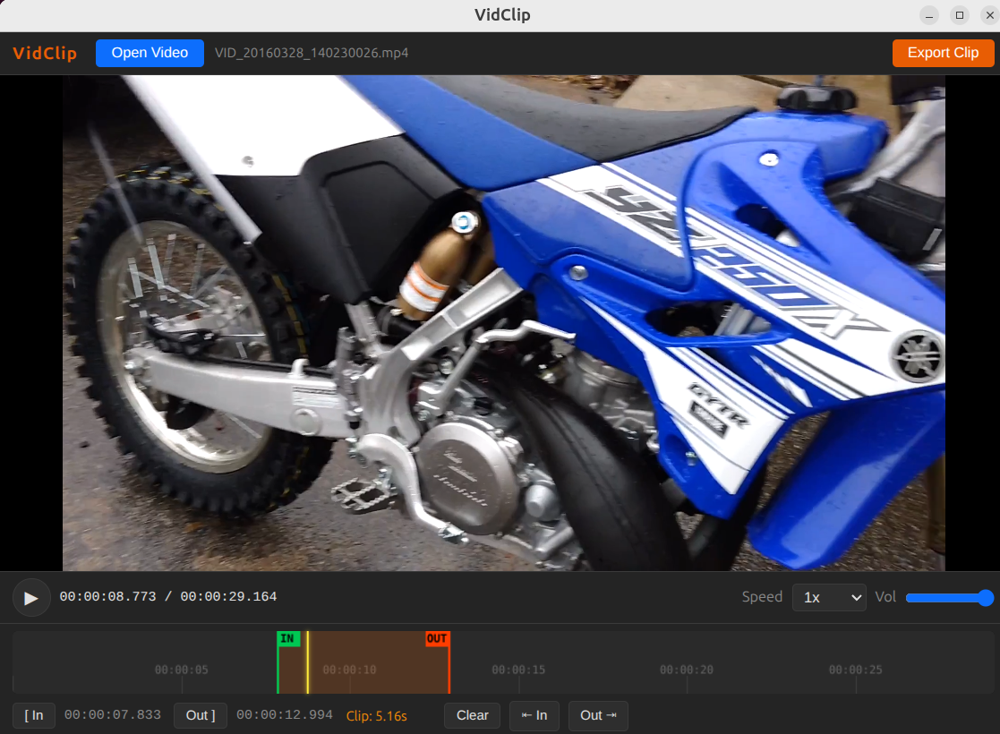

# VidClip

A lightweight video clipper built with Electron and FFmpeg. Load a video, mark in/out points on the timeline, and export the clip with full control over codec, resolution, and audio — no bloated editing suite required.



---

## Features

- **Video playback** — hardware-accelerated via Chromium's media pipeline
- **Timeline scrubbing** — click or drag to seek; draggable IN/OUT marker flags
- **In/Out point marking** — keyboard shortcuts or buttons; displays clip duration
- **FFmpeg export** with options for:
  - Video codec: Copy (no re-encode), H.264, H.265, VP9, AV1
  - CRF quality slider
  - Resolution: source, 4K, 1440p, 1080p, 720p, 480p, 360p
  - Audio codec: Copy, AAC, MP3, Opus, FLAC
  - Audio bitrate
  - Volume boost (0.1x – 5x)
  - EBU R128 loudness normalization
  - Output format: MP4, MOV, MKV, WebM
- **H.265/HEVC proxy transcoding** — automatically creates a playback proxy for codecs Chromium can't decode natively (e.g. GoPro HEVC footage); export always uses the original file
- **Drag & drop** — drop a video file directly onto the window
- **Self-contained** — FFmpeg and FFprobe are bundled; no system installation required

## Keyboard Shortcuts

| Key | Action |
|-----|--------|
| `Space` / `K` | Play / Pause |
| `I` | Set In point |
| `O` | Set Out point |
| `←` / `→` | Step 1 second |
| `Shift + ←` / `→` | Step 10 seconds |
| `J` | Slow down playback |
| `L` | Speed up playback |

---

## Installation

### Linux

**AppImage** (no install needed):
```bash
chmod +x VidClip-1.0.1.AppImage
./VidClip-1.0.1.AppImage
```

**Debian / Ubuntu**:
```bash
sudo dpkg -i vidclip_1.0.1_amd64.deb
```

### Windows

Run the `VidClip Setup 1.0.1.exe` installer.

### macOS

Open `VidClip-1.0.1.dmg` and drag VidClip to your Applications folder.

---

## Building from Source

**Prerequisites:** Node.js 18+

```bash
git clone https://github.com/patw/vidclip.git
cd vidclip
npm install
npm start
```

### Building distributables

```bash
npm run build:linux   # → dist/VidClip-1.0.1.AppImage + .deb
npm run build:win     # → dist/VidClip Setup 1.0.1.exe
npm run build:mac     # → dist/VidClip-1.0.1.dmg  (must run on macOS)
```

> **Cross-platform note:** `ffmpeg-static` and `ffprobe-static` download platform-specific binaries at `npm install` time. Build for each target platform on its native OS, or use a CI matrix (e.g. GitHub Actions) to produce all three.

---

## License

MIT
